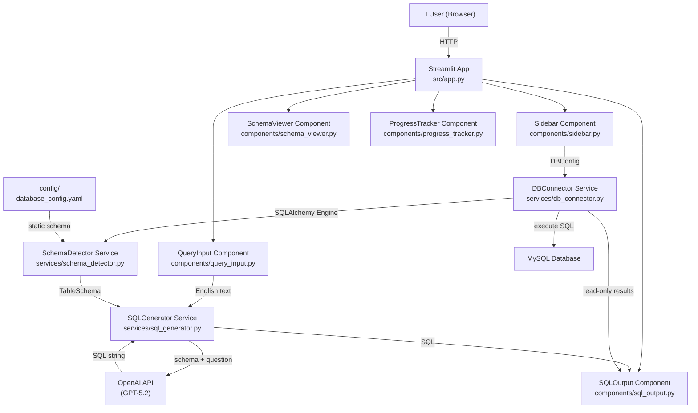

# System Architecture — Eng2SQL

## Overview

Eng2SQL is a single-container Python application built on Streamlit. All business logic
lives in Python services; the UI layer is thin and delegates to services for all
non-display work.

## Component Diagram



## Data Flow — Static Schema Mode

```
User types question
  → QueryInput captures text
  → ProgressTracker shows "Step 1: Parsing question..."
  → SchemaDetector.load_static_schema(yaml_path) → TableSchema
  → ProgressTracker shows "Step 2: Building prompt..."
  → SQLGenerator.generate_sql(question, schema) → OpenAI API
  → ProgressTracker shows "Step 3: Generating SQL..."
  → OpenAI returns SQL string
  → ProgressTracker shows "Step 4: Done ✅"
  → SQLOutput renders syntax-highlighted SQL
```

## Data Flow — Dynamic Schema Mode

```
User fills connection form → clicks "Connect"
  → DBConnector.create_engine(DBConfig) → SQLAlchemy Engine
  → SchemaDetector.detect_live_schema(engine) → TableSchema
  → SchemaViewer renders table/column list
  → [same as static from here]
  → User clicks "Execute SQL"
  → DBConnector.execute_query(engine, sql) → pd.DataFrame
  → st.dataframe renders results
```

## Key Interfaces

```python
# src/models/config.py
@dataclass
class DBConfig:
    host: str
    port: int
    user: str
    password: str
    database: str
    dialect: str = "mysql+pymysql"

@dataclass
class AppConfig:
    openai_api_key: str
    openai_base_url: str = "https://gpt4ifx.icp.infineon.com"
    openai_cert_path: str = "cert/ca-bundle.crt"
    model_name: str = "gpt-5.2"
    max_tokens: int = 500
    temperature: float = 0.1

@dataclass
class SchemaColumn:
    name: str
    type: str
    nullable: bool
    primary_key: bool

TableSchema = dict[str, list[SchemaColumn]]

# src/services/sql_generator.py
class SQLGenerator:
    def generate_sql(
        self,
        question: str,
        schema: TableSchema,
        dialect: str = "mysql",
    ) -> str: ...

# src/services/schema_detector.py
class SchemaDetector:
    def load_static_schema(self, config_path: str) -> TableSchema: ...
    def detect_live_schema(self, engine: Engine) -> TableSchema: ...

# src/services/db_connector.py
class DBConnector:
    def create_engine(self, config: DBConfig) -> Engine: ...
    def execute_query(self, engine: Engine, sql: str) -> pd.DataFrame: ...
    def test_connection(self, engine: Engine) -> bool: ...
```

## Non-Functional Requirements

| Requirement              | Target                              |
| ------------------------ | ----------------------------------- |
| SQL generation latency   | P95 < 5 seconds                     |
| Schema detection latency | < 2 seconds for < 100 tables        |
| DB query execution       | < 10 seconds (user-visible timeout) |
| Test coverage            | ≥ 80%                               |
| Container image size     | < 500 MB                            |
| Memory usage             | < 256 MB under normal load          |

## Security Architecture

- OpenAI API key: stored in `.env`, loaded via `python-dotenv`, never logged
- DB credentials: stored in `.env` or Streamlit secrets, never committed
- Generated SQL: read-only SELECT only; no DDL or DML exposed to users
- DB user: should have `SELECT` privilege only on target database
- Docker: non-root user (`appuser`), no privileged ports

## Technology Decisions

See Architecture Decision Records:
- [ADR-001](ADR-001-streamlit.md) — Streamlit as UI framework
- [ADR-002](ADR-002-openai.md) — OpenAI GPT-5.2 for SQL generation
- [ADR-003](ADR-003-sqlalchemy.md) — SQLAlchemy for schema inspection
- [ADR-004](ADR-004-pymysql.md) — PyMySQL as MySQL driver
- [ADR-005](ADR-005-yaml-schema.md) — YAML for static schema config
